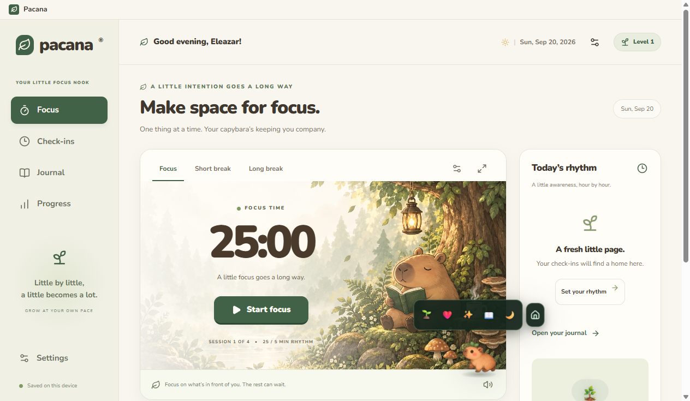
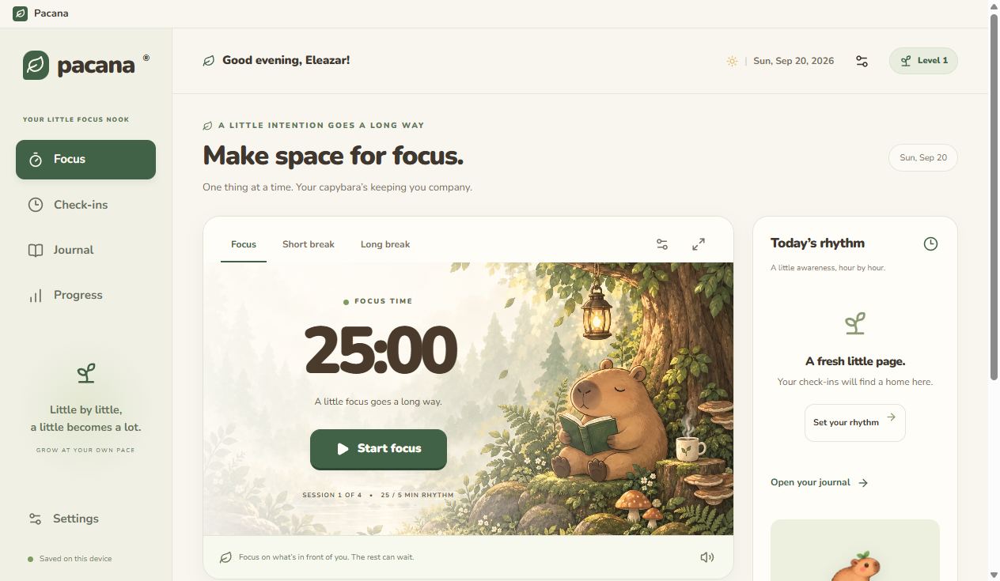
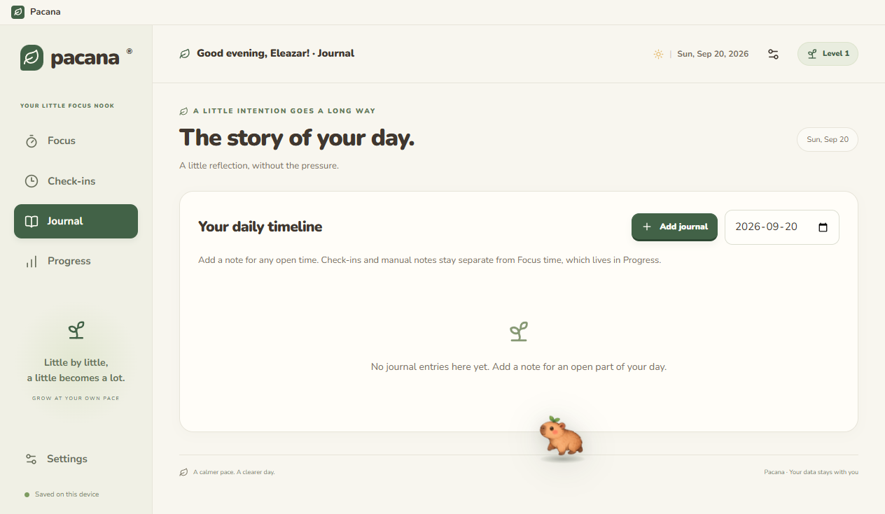
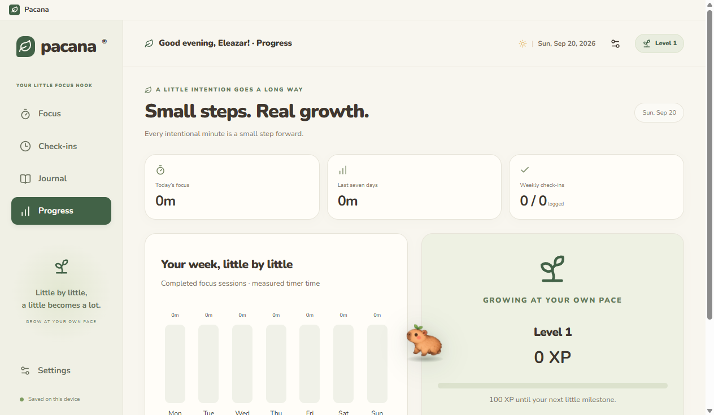
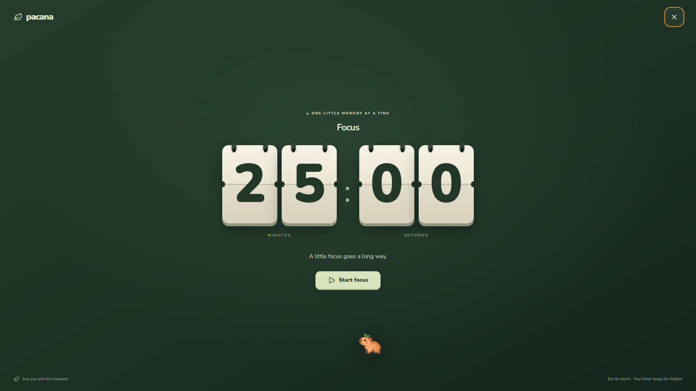
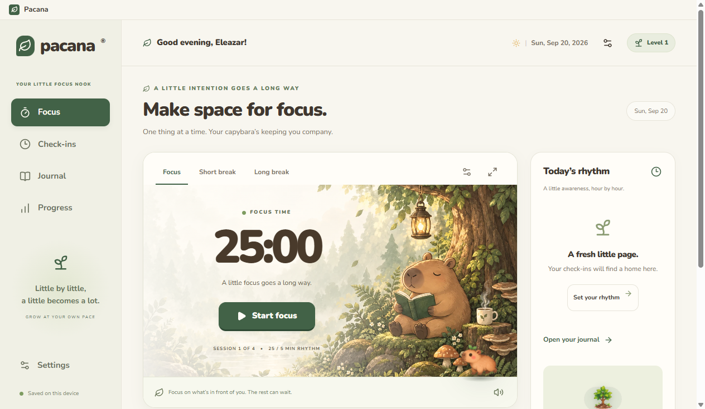

# 🐾 Pacana

<p align="center">
  <strong>A cozy, local-first focus timer and time journal with an interactive capybara companion.</strong>
</p>

<p align="center">
  <a href="LICENSE"></a>
  <a href="https://nodejs.org">=22.13.0" /></a>
  <a href="#-desktop-app"></a>
  <a href="#-local-first--privacy"></a>
</p>

<p align="center">
  
</p>

---

## 🌿 Overview

**Pacana** turns productivity into a gentle, grounding rhythm. Rather than treating time management like a high-stress corporate sprint, Pacana blends a **timestamp-accurate focus timer**, an **effortless time journal**, and an **autonomous capybara companion named Cappy** into a warm, distraction-free environment.

Built with a **local-first** architecture, Pacana requires no sign-ups, runs no background trackers, and stores 100% of your reflections and focus sessions directly on your device. Whether you use the offline-ready web app or the native Windows desktop application, your focus remains entirely yours.

---

## ✨ Features

- ⏱️ **Timestamp-Accurate Focus Engine**  
  Pomodoro-style intervals built on real wall-clock timestamps rather than drift-prone intervals. Survives computer sleep, tab throttling, and application restarts without losing your place or recording phantom sessions.
- 🔄 **Balanced Session Rhythm**  
  Structured cadence where **1 session = 1 focus block + 1 short break**. Completing 4 sessions unlocks an extended long break to encourage sustainable pacing.
- 🐹 **Interactive Capybara Companion (Cappy)**  
  An autonomous desktop buddy who wanders the screen, avoids UI cards with real obstacle-aware pathfinding, takes naps, reacts to emotes (heart, sparkle, read, sleep), and eats snack trees you plant for him.
- 📓 **Time Journal & Hourly Check-ins**  
  Gentle, non-intrusive reflection prompts that let you record quick notes and photo attachments throughout the day. Accumulated checkpoints can be reviewed whenever you are ready.
- 🌱 **Experience Points & Mindful Progress**  
  Earn 1 XP for every minute of focus and 5 XP for every journal check-in. Level up and visualize your daily and weekly rhythm without guilt-inducing streak penalties.
- 📺 **3D Flip-Tile Scoreboard Timer**  
  A fullscreen mode inspired by mechanical split-flap scoreboards. Designed to turn your second monitor or laptop display into an elegant, distraction-free focus clock.
- 🔔 **Calming Synthesized Ringtones**  
  Soothing, handcrafted audio alarms (Chime, Bell, Digital, Marimba, Flute, Birds) synthesized via the Web Audio API with zero external audio dependencies.
- 🔒 **100% Local-First & Private**  
  All session logs, journal entries, reflections, and settings are saved in your browser or desktop IndexedDB. Zero accounts, zero ads, zero telemetry.
- 💾 **Full JSON Backup & Migration**  
  Export your entire database to a validated JSON file in one click, and import it into another browser or the desktop app with automatic schema verification.
- 🖥️ **Native Windows Desktop Application**  
  Packaged with Electron 39 featuring isolated local protocols, native window management, single-instance protection, and a standalone Squirrel Windows installer.
- 📴 **Offline-First Resilience**  
  Equipped with a custom Service Worker that precaches all application bundles, local Nunito typography, and gouache woodland artwork for instant loading without an internet connection.

---

## 📸 Screenshots

| Focus Workspace | Meet Cappy |
| :---: | :---: |
| <br /><sub>Clean timer card, customizable session intervals, category tags, and today's rhythm.</sub> | <br /><sub>Autonomous capybara friend with squarish quick-action menu (Heart, Sparkles, Read, Sleep).</sub> |

| Time Journal | Progress & XP |
| :---: | :---: |
| <br /><sub>Chronological daily timeline merging completed focus blocks and reflection check-ins.</sub> | <br /><sub>Level progression, weekly activity breakdown, and mindful consistency metrics.</sub> |

| 3D Scoreboard Fullscreen Mode | Windows Desktop App |
| :---: | :---: |
| <br /><sub>Mechanical flip-tile scoreboard display for immersive, distraction-free deep work.</sub> | <br /><sub>Packaged Windows Electron app with native performance and offline reliability.</sub> |

---

## 🐹 Meet Cappy

Cappy is your cozy companion who shares your workspace while you focus.

<p align="center">
  
</p>

### Autonomous Behaviors & Physics
- **Smart Obstacle Avoidance**: Cappy navigates the screen using ray-box intersection algorithms and waypoint pathfinding (`core/obstacle-navigation.ts`), intelligently steering around timer cards, control buttons, and modals.
- **Draggable & Responsive**: Click and drag Cappy anywhere across the screen. When released, he gently reorients and continues his walk.
- **Undisturbed Sleeping**: Put Cappy to sleep with the 💤 emote. He will peacefully nap in place until you choose to wake him up by dragging him, clicking on him, or choosing another action.
- **Tree Snack Sprouting**: Click the leaf emote (🍃) to sprout a snack tree randomly on the page. Cappy reacts with surprise, walks over to the tree, eats the leaves, and returns to his normal stroll. Even if you interrupt him mid-walk with an emote or drag him away, he remembers his snack and heads back to finish eating.
- **Call Cappy Home**: Need Cappy close by? Click the 🏠 icon to summon him immediately back to his cushion next to the timer.

---

## ⏱️ Focus Engine

Pacana avoids the common pitfalls of web-based timers by decoupling UI countdowns from real-world time:

```
                  ┌──────────────┐
                  │  Idle State  │
                  └──────┬───────┘
                         │ Start Focus
                         ▼
             ┌─────────────────────────┐
             │   Focus Block (25 min)  │
             └───────────┬─────────────┘
                         │ Complete (+25 XP)
                         ▼
             ┌─────────────────────────┐
             │   Short Break (5 min)   │
             └───────────┬─────────────┘
                         │
             ┌───────────┴───────────┐
             │ 4 Sessions Completed? │
             └───┬───────────────┬───┘
              No │               │ Yes
                 ▼               ▼
         Next Session      Long Break (15 min)
```

- **Absolute Timestamp Persistence**: Timers store exact UTC target deadlines. If your laptop enters sleep mode, the browser tab throttles background tasks, or you reboot your computer, Pacana calculates exact elapsed time upon resumption and completes the current phase without drift.
- **Continuous Auto-Start or Mindful Pauses**: Choose whether breaks and subsequent sessions trigger automatically or wait for your explicit confirmation.
- **Clock Schedule vs. Start Now**:
  - **Start Now**: Immediate on-demand focus blocks.
  - **Clock Schedule**: Align sessions to wall-clock boundaries (e.g. top of the hour). Handles daylight saving time (DST) shifts smoothly without duplicate triggers.

---

## 📓 Journal & Check-ins

- **Mindful Checkpoints**: Schedule hourly or periodic check-ins to record what you worked on, how your energy felt, and what is next.
- **Photo Reflections**: Attach visual memories, sketches, or whiteboard photos directly to your journal entries (persisted locally in IndexedDB).
- **Non-Destructive Reconciliation**: Review pending checkpoints at your own convenience. Check-ins never interrupt an active focus sprint.

---

## 🌱 Progress & XP

Pacana uses a positive, non-judgmental progression system:
- **Focus Time**: Earn **1 XP** per completed minute of focus.
- **Reflections**: Earn **5 XP** per recorded journal check-in.
- **No Penalties**: Abandoned sessions or missed intervals do not deduct XP or reset arbitrary streak counters.
- **Weekly Insights**: View daily focus distributions, completion totals, and reflection frequency.

---

## 🔒 Local-First & Privacy

Your personal reflections and work habits belong to you:

- **No Remote Database**: Data is stored exclusively in your browser's IndexedDB (`pacana-db`).
- **No Telemetry or Tracking**: No analytics scripts, tracking pixels, or third-party monitoring.
- **Full Data Portability**: Export your entire dataset as a clean, human-readable JSON file (`Settings → Export Backup`).
- **Validated Restoration**: Import files are strictly validated with Zod schemas (`data/backup.ts`), rejecting corrupted or incompatible files before touching your local database.

---

## 📴 Offline-First Experience

Pacana is engineered to function completely disconnected from the internet:

- **Precached Assets**: The custom Service Worker (`scripts/offline-build.mjs`) caches all HTML, CSS, JavaScript bundles, artwork, and audio files.
- **Self-Hosted Typography**: The Nunito font family is bundled locally to eliminate Google Fonts network requests.
- **Transparent Web Limits**: In standard web browsers, background alarms cannot trigger if the browser tab or window is entirely closed. For guaranteed background alarm persistence, use the desktop app.

---

## 🖥️ Desktop Application

The native Windows desktop application offers enhanced OS integration:

- **Electron 39 Runtime**: Native desktop performance with isolated process privileges.
- **Custom `pacana:` Protocol**: Serves pre-built static assets locally via a secure custom scheme without running an internal HTTP server.
- **Single-Instance Lock**: Prevents duplicate application windows when opened multiple times.
- **Squirrel Windows Installer**: Packaged into an automated, standalone setup executable (`Pacana-Setup.exe`).

---

## 🧱 Tech Stack

| Layer | Technologies |
| :--- | :--- |
| **Frontend Framework** | [React 19](https://react.dev/), [Next.js](https://nextjs.org/) App Router (via [vinext](https://github.com/cloudflare/vinext) & [Vite](https://vitejs.dev/)) |
| **Language** | [TypeScript 5.9](https://www.typescriptlang.org/) |
| **Styling & UI** | [Tailwind CSS v4](https://tailwindcss.com/), [Radix UI](https://www.radix-ui.com/), [Lucide Icons](https://lucide.dev/) |
| **Local Storage** | [IndexedDB](https://developer.mozilla.org/en-US/docs/Web/API/IndexedDB_API), [Zod 3](https://zod.dev/) validation |
| **Desktop Shell** | [Electron 39](https://www.electronjs.org/), `@electron/packager`, `electron-winstaller` |
| **Testing** | Node.js built-in Test Runner (`node:test`), `fake-indexeddb` |

---

## 🏗️ Architecture & Project Structure

```
pacana/
├── app/                  # Next.js App Router layouts, pages, and entrypoints
├── components/           # UI components & interactive controllers
│   ├── capy-sprite.tsx           # Sprite frame rendering & animation
│   ├── interactive-companion.tsx # Cappy autonomous NPC controller & physics
│   ├── fullscreen-timer.tsx      # 3D mechanical flip-tile scoreboard
│   ├── timer-card.tsx            # Main focus timer controls & session displays
│   ├── journal-sheet.tsx         # Time journal & reflection editor
│   └── progress-card.tsx         # XP levels, stats, and consistency charts
├── core/                 # Pure domain logic (framework-agnostic)
│   ├── engine.ts                 # Pomodoro state machine & timestamp reconciliation
│   ├── model.ts                  # Zod schemas, data contracts & default settings
│   ├── obstacle-navigation.ts    # Ray-box collision & obstacle avoidance pathfinding
│   └── format.ts                 # Time, date, and duration formatting helpers
├── data/                 # Persistence layer
│   ├── store.ts                  # IndexedDB transactions & local storage operations
│   └── backup.ts                 # Version-1 JSON backup import/export validation
├── desktop/              # Electron desktop application
│   ├── main.cjs                  # Electron main process, window management & pacana: protocol
│   └── paths.test.cjs            # Desktop packaging path verification
├── docs/                 # Documentation assets
│   └── images/                   # Full-resolution application screenshots
├── public/               # Static assets, Cappy sprite sheets, audio chimes, fonts
├── scripts/              # Build, test, offline caching, and packaging scripts
└── tests/                # Automated test suite (27 passing unit tests)
```

---

## 🚀 Getting Started

### Prerequisites
- **Node.js**: `>= 22.13.0`
- **npm**: `>= 10.0.0`

### Installation & Development

```bash
# 1. Clone the repository
git clone https://github.com/razaele0003/pacana.git
cd pacana

# 2. Install dependencies
npm run install:ci

# 3. Start the local development server
npm run dev
```

Open [http://localhost:5173/app](http://localhost:5173/app) in your browser.

> [!TIP]
> **Windows PowerShell Users**: If your system execution policy restricts `npm` script execution, run commands via `cmd /c npm <command>` or invoke Node directly:
> ```powershell
> cmd /c npm run dev
> ```

---

### Verification & Testing

```bash
# Run the full automated test suite (27 unit tests)
npm test

# Run TypeScript typecheck
npm run typecheck

# Run ESLint check
npm run lint

# Verify desktop paths and launch smoke test
npm run desktop:check
npm run desktop:smoke
```

---

### Building for Production

```bash
# Build web app with versioned offline service worker
npm run build

# Build standalone desktop package
npm run desktop:package

# Build complete Windows installer (Pacana-Setup.exe)
npm run desktop:installer
```

The Windows installer will be generated in `desktop-output/installer/Pacana-Setup.exe`.

---

## 🎨 Art & Design

- **Gouache Woodland Aesthetic**: Warm, earthy colors designed to reduce eye strain and foster a peaceful environment for focused work.
- **Original Capybara Sprite Sheet**: Handcrafted 4-pose companion sheet (`public/capy-sprite.png`) featuring idle, walking, sleeping, and eating animations.
- **Nunito Typography**: Rounded, highly readable typeface bundled locally for offline use.

---

## 🌿 Philosophy

Focus is not a high-stress race, and productivity shouldn't feel punitive. Pacana was built around three simple beliefs:

1. **Mindfulness over Hustle**: Taking intentional breaks is just as vital as doing deep work.
2. **True Data Ownership**: Your personal thoughts, journal notes, and daily rhythms belong exclusively to you—not a remote cloud server.
3. **Joy in Small Things**: Having a little friend like Cappy wandering your screen brings warmth and delight to everyday tasks.

---

## 📄 License

Distributed under the **MIT License**. See `LICENSE` for more information.
